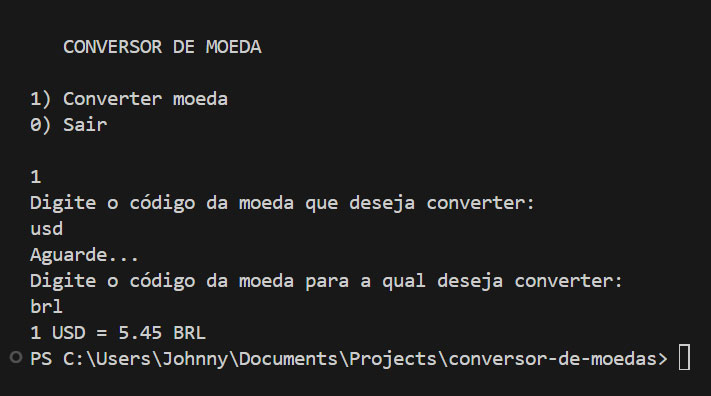

# Conversor de Moeda

Desafio do ONE (Oracle Next Education).

Um programa para converter moedas dinamicamente com o uso de uma API.

Ao inicializar o conversor, é solicitado ao usuário que digite o código monetário da moeda da qual deseja converter o valor. 
O código monetário recebido é então validado, e passado para uma nova instância da classe Exchanger, que automaticamente aciona o método `retrieveData()` em seu construtor.

O método `retrieveData()` é um método privado da classe `Exchanger` que se comunica com a API `exchangerate-api` e recebe os dados de uma moeda e suas conversões de câmbio em formato JSON. 
Os dados recebidos são então convertidos para um objeto do tipo `JSONObject` e armazenados na propriedade `conversion_rates`.

Em seguida, o conversor solicita ao usuário que digite o código monetário da nova moeda moeda para a qual deseja converter o valor da moeda base. 
Após a validação do código monetário, o método `exchanger.convertTo(target_code)` é acionado, buscando o valor de câmbio da nova moeda armazenada em `conversion_rates`, e retornando seu valor em formato double.